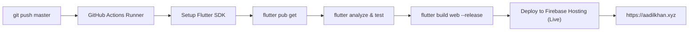

# Automated CI/CD Pipeline with GitHub Actions & Firebase Hosting

This document explains the automated **Continuous Integration / Continuous Deployment (CI/CD)** pipeline configured for your portfolio application.

---

## 1. How the Pipeline Works

Whenever you push code to `master` or `main`:



- **Trigger on Push to `master`/`main`**: Automatically compiles and deploys to production live channel.
- **Trigger on Pull Requests**: Automatically compiles and spins up a temporary **Firebase Preview Channel URL** so you can preview changes before merging!
- **Manual Trigger**: Supports `workflow_dispatch` (can be triggered manually anytime via GitHub Actions tab).

The workflow configuration is located at:
[`.github/workflows/deploy-portfolio.yml`](../.github/workflows/deploy-portfolio.yml)

---

## 2. Setting Up the Firebase Secret in GitHub

To allow GitHub Actions to securely deploy to your Firebase project (`portfolio-aadil-khan`), you must add a Firebase Service Account key to your GitHub repository secrets.

### Option A: Automatic Setup using Firebase CLI (Fastest)

Run the following command inside the `portfolio/` project directory on your local machine:

```bash
firebase init hosting:github
```

1. It will authenticate with GitHub via browser.
2. Select your repository: `AADILKHAN99A/App_Development`.
3. It will automatically:
   - Create a dedicated Google Cloud Service Account with minimum required deployment permissions.
   - Automatically inject the secret into your GitHub repository secrets.
   - Set up the deployment key.

---

### Option B: Manual Setup via Google Cloud Console

If you prefer setting it up manually:

#### Step 1: Generate Service Account Key
1. Open the [Google Cloud Console](https://console.cloud.google.com/).
2. Select project: **`portfolio-aadil-khan`**.
3. Go to **IAM & Admin** > **Service Accounts**.
4. Click on the Firebase Hosting deployment service account (e.g., `firebase-adminsdk` or click **Create Service Account** with the role **Firebase Hosting Admin**).
5. Click the **Keys** tab > **Add Key** > **Create new key**.
6. Select **JSON** and click **Create**. A `.json` key file will download to your computer.

#### Step 2: Add Secret to GitHub
1. Open your repository on GitHub:
   `https://github.com/AADILKHAN99A/App_Development`
2. Click **Settings** > **Secrets and variables** > **Actions**.
3. Click the **New repository secret** button.
4. Set the secret details:
   - **Name**:
     ```
     FIREBASE_SERVICE_ACCOUNT_PORTFOLIO_AADIL_KHAN
     ```
   - **Secret**:
     Open the downloaded JSON key file in a text editor, copy its entire contents (including `{` and `}`), and paste it directly into this field.
5. Click **Add secret**.

---

## 3. Testing Your Pipeline

Once the secret is added:
1. Commit and push any change to your repository:
   ```bash
   git add .
   git commit -m "feat: setup automated CI/CD pipeline"
   git push origin master
   ```
2. In your GitHub repository, click on the **Actions** tab.
3. You will see the workflow **"Deploy Portfolio to Firebase Hosting"** running.
4. Upon completion:
   - Static analysis is verified.
   - Unit and widget tests pass.
   - Web application is compiled to `build/web/`.
   - Your portfolio is deployed live to `portfolio-aadil-khan.web.app` and your custom domain `aadilkhan.xyz`!
