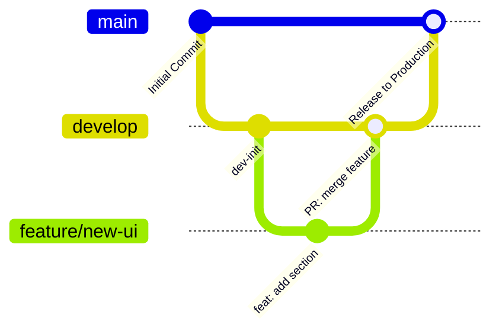

# Git Management & Branching Strategy

This repository adheres to the **GitHub Flow & Git Flow Hybrid Standard** for version control, automated testing, and continuous delivery.

---

## 1. Branch Taxonomy



### Branch Responsibilities

| Branch | Purpose | Deployment Target | Protection |
| :--- | :--- | :--- | :--- |
| **`main`** | Production-ready, stable codebase | Deploys directly to live Firebase Hosting (`https://aadilkhan.xyz`) | Protected; requires PR & status checks |
| **`develop`** | Integration and staging branch for active development | Deploys to Firebase Hosting preview / staging channel | Primary work integration branch |
| **`feature/*`** | Specific feature implementation | Temporary preview channels | Ephemeral; branch off `develop` |
| **`fix/*`** | Bug and layout fixes | Preview channels | Ephemeral; branch off `develop` |
| **`hotfix/*`** | Urgent production fixes | Live channel on merge | Branch off `main`, merge to both `main` & `develop` |

---

## 2. Standard Workflow for New Changes

### Step 1: Sync and Create a Feature Branch
Always start fresh from the latest `develop`:
```bash
git checkout develop
git pull origin develop
git checkout -b feature/my-new-feature
```

### Step 2: Make Changes and Commit Using Conventional Commits
Use semantic, structured commit messages:
```bash
# Examples:
git commit -m "feat(home): add dynamic typing hero animation"
git commit -m "fix(responsive): resolve nav bar overflow on mobile"
git commit -m "docs(api): update project structure guide"
git commit -m "style(theme): enhance dark mode contrast"
```

### Step 3: Run Local Pre-commit Quality Checks
Always ensure tests and lints pass before pushing:
```bash
fvm flutter analyze
fvm flutter test
```

### Step 4: Push Feature Branch & Open a Pull Request
```bash
git push -u origin feature/my-new-feature
```
Open a Pull Request on GitHub targeting `develop`:
- GitHub Actions will automatically run `flutter analyze` and `flutter test`.
- It spins up a temporary **Firebase Preview URL** for visual QA.

### Step 5: Merge to `main` for Production Release
When ready to release to production:
1. Merge `develop` into `main` via Pull Request on GitHub.
2. The GitHub Actions CI/CD pipeline triggers immediately and updates **`https://aadilkhan.xyz`** live!
